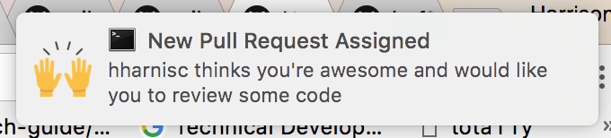

# Github Notify Client

Get notifications for pull requests assigned to you!



Note: currently this is only hooked up to the `buffer-web` repo. But could be added to any repo! Send me a request if you want it added!

## Usage

```sh
npm i
node index -n <your github handle> -s <the github-notify-server url>
```

example

```sh
npm i
node index -n hharnisc -s https://some.now.service.sh
```

When a PR is assigned to you, you'll get a system notification. Clicking on the notification will open it up in your browser 🚀

## How Does This Work

Github Webhook (with Pull Request permissions) -> [Now Microservice](https://zeit.co/now) -> Socket.IO client
